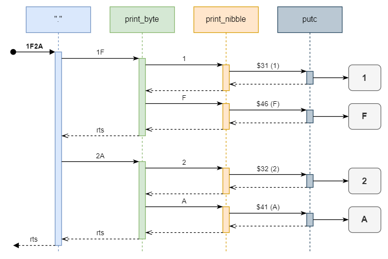

# AlexForth for 6809 - Journal

# Day 4 - About handling user I/O...

Forth is an interactive language. It usually presents a prompt, for the user to enter numbers, call exiting words and write new words definition.

Not only do we need to read input from the user, but we also need to print things back to the output.

In this article, we'll start implementing the foundations for such inpout and output, starting with some basic I/O routines, and then implementing some foundational Forth words to handle I/O.

## Basic I/O routines

At the moment the target to develop and run AlexForth 6809 is my Emu6809 emulator. In this context, there are two special addresses:

```
; IO Addresses
IN_CHAR         EQU $F004
OU_CHAR         EQU $F001
```

Loading a byte from `IN_CHAR` will effectively read a byte (character) from the emulator input (console).

Likewise, writing a byte (char) to `OU_CHAR` will result in the emulator outputting the char on the console output.

In that context, the I/O routines for AlexForth are trivial:

```
; IO Routines

getc
    ; load a char from input into B
    LDB IN_CHAR
    BEQ getc
    RTS

putc
    ; send char in B to output
    STB OU_CHAR
    RTS
```

To port AlexForth 6809 to a physical we would just need to modify those routines according to the I/O components on the board (serial port for example).

## Basic I/O Forth Words

Now, we can write a couple of corresponding Forth words that will read or write from or to the console.

`EMIT` will pull a word from the stack and put it in the `D` register, the low byte will then be in `B` register, ready for us to then call `putc` to send it to the output:

```
defword "EMIT"
; EMIT emit a single char
    ; char is on stack
    PULU D
    JSR putc
    NEXT
```

Similarly, `GETC` is again self explanatory: we clear `A` (High byte of `D`), call `getc` to read a byte from input into `B` and push `D` to the data stack:

```
defword "GETC"
; get a single char from IO, leave on stack
    CLRA
    JSR getc ; leaves the char in B
    PSHU D
    NEXT
```

## Input Buffer

Input buffer management: two parts: one we fill it (that is what happens when the user is presented a prompt, until he hits the return key). Then we'll consume it. The most usual way to read the buffer in Forth will beextracting space separated tokens from it.

### Input buffer variables

We first define these *variables* (labels in the source that point to memory places where we will later store values):

```
INPUT               RMB     MAX_LEN ; CMD string (extend as needed, up to 256!)
INPUT_BUFFER_END    RMB     2       ; Addr of the first byte after INPUT buffer
INPUT_END           RMB     2       ; End of the INPUT string
INPUT_IDX           RMB     2       ; Position into the input buffer
```

The input buffer starts at INPUT, and has a length of MAX_LEN.
When we stop filling the input buffer, we'll store the address of the end of the string into INPUT_END.
When we advance though the input buffer, we'll store the position we're at into INPUT_IDX.

### Input Buffer Routines

`getline` is an assembly routine that will refills the INPUT buffer.

It starts by resetting `INPUT_IDX` topoint to the INPUT (start of INPUT buffer).
Then a loop will red characters from the input device by calling getc.
If the character is a backspace, it will erase the last character in the buffer as well as on the screen (here we assume the output is a screen).
Otherwise it will add the character to the buffer. Finally, if the character was a newline, it will print a new line, set `INPUT_END` and exit.

`_KEY` is a routine that returns the next character fro the input buffer, internally advancing the `INPUT_IDX` pointer. Whenever the buffer is empty it first calls `getline` to fill it up. The Forth word `KEY` is simply a wrapper word calling `_KEY`.

`PARSE` is a Forth word that takes a separator as argument (a character) and returns the next token from the input buffer (a token is anything between the separators). The returned values are the address and length of the token string (if any) found between two separators. `PARSE` uses the `_KEY` routine.

Lastly, `WORD` is another Forth word that will simply parse the input buffer using a space (`' '`) separator. We will use it to parse each token (a word or a number) from the input buffer. `WORD` calls `PARSE`.

## Printing more complex values

In this sections we'll look at how to implement the `.` (dot) word in a primitive form: for now it will simply output the hex value of the cell on top of the stack.

Until now we've only seen how to output a single char from its ASCII char code (in the B register) using `putc`.

Printing the value stored in ToS (or in a 16 bit register) amounts to printing two bytes' values: first we will its high-byte, then its low-byte.

Similarty printing a byte's value amounts to printing two nibbles value. Now, this is something we can do with `putc` after translating the nibble's value into the corresponding ASCII char code.

In the code I have implemented two routines for that purpose: `print_byte` and `print_nibble`.

So basically if we want to output the value `1F2A`, we shall first output the byte `1F`. In turn, this shall print the first nibble `1`: this shall compute the corresponding char code (`$31`) and call `putc` to output a `1`...

We can visualize the full process in a sequence diagram:



## Recap

This article focuses on implementing some routines to handle user I/O in AlexFORTH:

- We started with low level routines that read and write a single char (`getc` and `put`), and write corresponding Forth words (`GETC` and `EMIT`).
- We then looked at how to get more input from the user, by implementing an input buffer. This involves `getline` for refilling the buffer, `_KEY` to read the next char in the buffer, `PARSE` and `WORD` that ultimately will parse out tokens from the buffer.
- Finally, we looked at the implementation of a primitive version of the `.` word.

All this will prove useful towards implementing AlexForth's outer interpreter in future days.